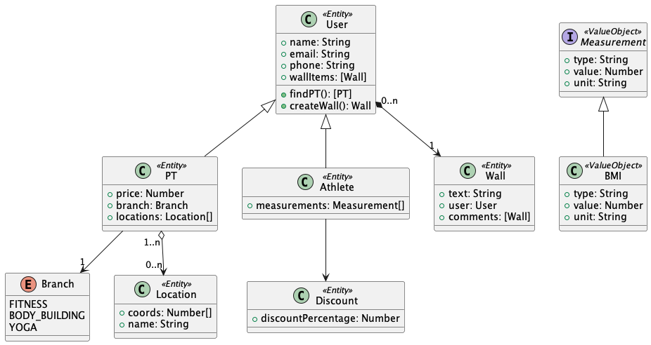
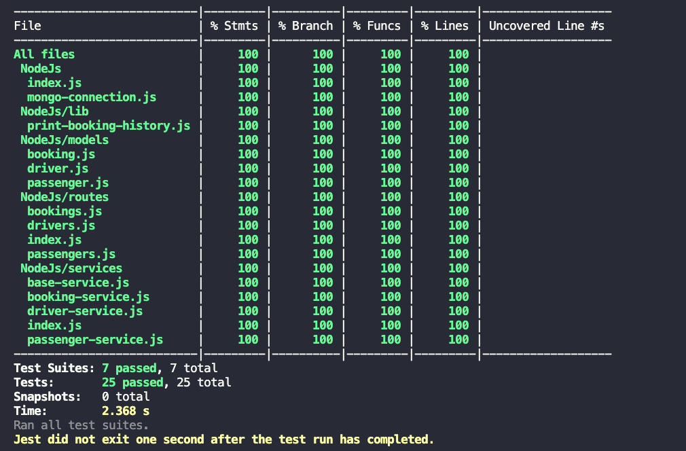

### Ride Hailing: A taxi booking web application

- **Puml** used to design uml diagrams of app's services

- Service implemented using **Node.js**
- API's created with **Express** 
- The template of the website was created dynamically with **Pug**(component based)
- **Axios** is used to make requests from frontend to backend
- **MongoDB** is used for database management
- **Jest** is used for testing (Unit Test and E2E Api Testing)

- These are tests:

